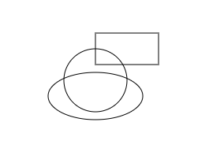

# grender

A lightweight canvas library for 2D.

文档地址: https://nashaofu.github.io/grender/

## examples

```js
import GRender, { Rect, Circle, Ellipse } from 'grender'

const grender = new GRender(document.querySelector('#canvas'))

const rect = new Rect({
  shape: {
    x: 120,
    y: 40,
    width: 80,
    height: 40
  }
})

const circle = new Circle({
  shape: {
    x: 120,
    y: 100,
    r: 40
  }
})

const ellipse = new Ellipse({
  shape: {
    x: 120,
    y: 120,
    rx: 60,
    ry: 30
  }
})

grender.add(rect)
grender.add(circle)
grender.add(ellipse)
```



## TODOS

- [ ] ctx 编写一个代理层，方便控制 API 权限，同时也有利于 ts 编译
- [ ] ctx 的画笔也要抽取与归纳，不要直接使用原生的，所以需要提取一个 style 对象
- [ ] shape类应该提供style build的函数，用来返回整理后的样式
